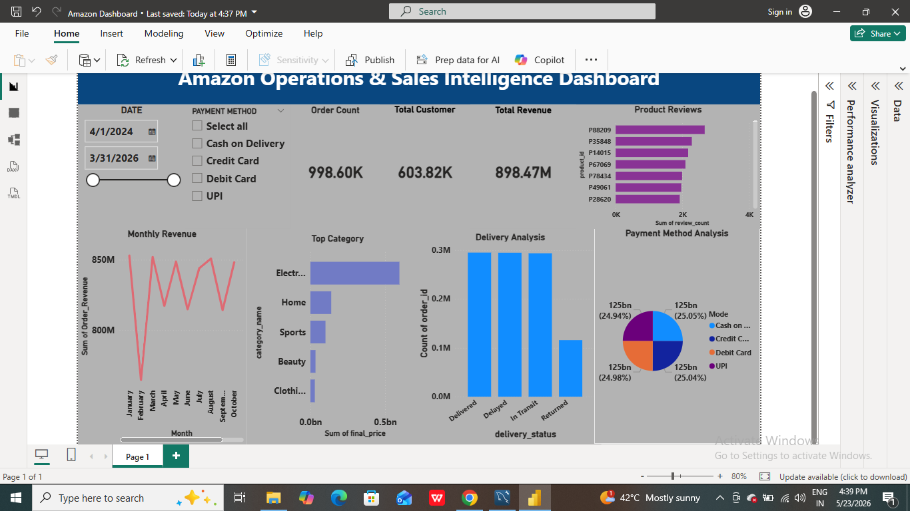

# Amazon E-Commerce Analytics Project

## Project Overview

This end-to-end analytics project simulates a real-world e-commerce data system similar to Amazon.  
It covers the complete data pipeline from **SQL database design → data cleaning → exploratory analysis → machine learning → forecasting → business intelligence dashboarding**.

The goal is to extract actionable business insights and build predictive models for operational and revenue optimization.

---

## Key Business Objectives

- Analyze sales performance and revenue trends
- Identify top-performing products and categories
- Understand customer behavior and segmentation
- Predict delivery delays using machine learning
- Forecast future revenue trends
- Build executive-level dashboards for decision-making

---

## Tech Stack

- **SQL (MySQL)** – Data storage & relational modeling  
- **Python** – Data analysis & machine learning  
- **Pandas / NumPy** – Data processing  
- **Matplotlib** – Visualization  
- **Scikit-learn** – Machine learning models  
- **Power BI** – Interactive dashboards  
- **Jupyter Notebook** – Development environment  

---

## Database Schema

The project includes the following relational tables:

- orders (fact table)
- customers
- products
- sellers
- payments
- category
- reviews

Star schema design is used where:
- `orders` is the central fact table
- Other tables act as dimension tables

---

## SQL Analysis

Key SQL operations performed:

- Joins across multiple tables
- Revenue aggregation
- Customer-level analysis
- Category-wise performance
- Payment method distribution
- Seller performance tracking

---

## Data Cleaning

- Removed duplicates
- Handled missing values
- Standardized data types
- Created new features:
  - delivery_delay
  - revenue metrics
  - time-based features

---

## Exploratory Data Analysis (EDA)

Key insights generated:

- Monthly revenue trends
- Top product categories by revenue
- Customer purchase behavior
- Return rate analysis
- Payment method distribution
- Shipping time distribution

---

## Machine Learning Model

### Objective:
Predict whether an order will be delayed.

### Algorithm Used:
- Random Forest Classifier

### Features Used:
- Price
- Final price
- Product rating
- Review count
- Seller rating

### Evaluation Metrics:
- Accuracy Score
- Confusion Matrix
- Classification Report
- Feature Importance

---

## Forecasting

A time-series model was built to:

- Analyze monthly revenue trends
- Apply moving average forecasting
- Predict future revenue patterns

This helps in:
- Inventory planning
- Demand forecasting
- Business strategy planning

---

## Power BI Dashboard

Interactive dashboards include:

- Revenue trends
- Category performance
- Payment method analysis
- Customer segmentation
- Operational KPIs
- Delivery delay insights

---

## Project Structure

---

## Key Insights

- Revenue shows strong monthly variation with seasonal spikes
- Certain categories contribute disproportionately to total revenue
- Delivery delays are influenced by price, seller rating, and product category
- Payment method usage varies significantly across customers

---

## Business Impact

This project demonstrates:

- Data-driven decision making
- Predictive analytics for logistics optimization
- Customer segmentation strategies
- Revenue forecasting for business planning

---

## Dashboard Preview

---

## Future Improvements

- Real-time streaming data pipeline
- Advanced time-series forecasting (ARIMA/Prophet)
- Recommendation system (collaborative filtering)
- Cloud deployment (AWS / Azure)

---

## Author

**Shubhneet Tiwari**

- Data Analytics | Business Intelligence | SQL | Python | Power BI

---

## Conclusion

This project demonstrates an end-to-end analytics pipeline similar to real-world e-commerce companies like Amazon, Flipkart, and Swiggy.

It is designed to showcase **industry-level data analytics, machine learning, and business intelligence skills.**
